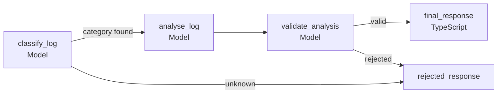

# typescript-langgraph-workflow

LangGraph workflow that diagnoses one application log line with local models running through Ollama.

## Install

Install [Ollama](https://ollama.com/download) and download the models:

```bash
ollama pull granite3-dense:2b
```

Install the Node.js requirements:

```bash
npm install
```

## Run

Run the verbose example:

```bash
npm run start -- example.log --verbose
```

Pass a log line directly:

```bash
npm run start -- --input "ERROR api - Request rejected: authentication token expired" --verbose
```

## Workflow



The first error or warning line becomes a work package diagnosis. Zod validates each model response, LangGraph shares state between nodes, and TypeScript builds the final response.

The workflow uses IBM Granite 3 Dense 2B for every node. Change it with `OLLAMA_MODEL`.

## Example output

```json
{
  "final_result": {
    "category": "authentication",
    "probable_cause": "The client or application making the API request has not provided a valid or refreshed authentication token.",
    "confidence": 90,
    "recommended_next_steps": [
      "Check if the authentication token is being properly stored and refreshed.",
      "Verify that the token is not expired and has sufficient validity period.",
      "Ensure the client application is correctly handling token expiration events.",
      "Contact the API provider or support team if the issue persists."
    ]
  }
}
```

The exact response may vary between runs.

## References

- [LangGraph](https://docs.langchain.com/oss/javascript/langgraph/overview)
- [LangChain Ollama](https://docs.langchain.com/oss/javascript/integrations/chat/ollama)
- [Ollama](https://ollama.com/)
- [Zod](https://zod.dev/)
